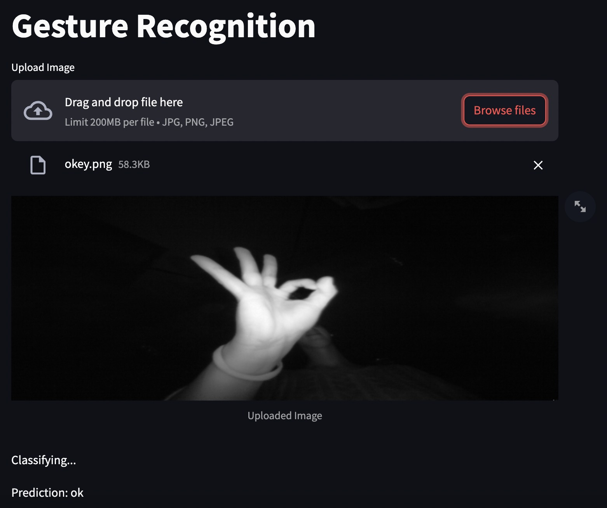

# Gesture Recognition Project

This project focuses on developing a gesture recognition system using deep learning techniques. The system is capable of recognizing hand gestures from images uploaded by users.

## Files

- **gest_model.pth**: Pre-trained PyTorch model for gesture recognition.
- **requirements.txt**: File containing the required Python packages for running the project.
- **Gesture_Recognition_with_Leap_Motion_Dataset.ipynb**: Python script used to train the gesture recognition model.
- **main.py**: Main script to run the Streamlit web application for gesture recognition.

## How to Run

1. **Install Dependencies**: Ensure you have all the required dependencies installed by running the following command:
pip install -r requirements.txt

2. **Run the Streamlit App**: Execute the following command to start the Streamlit web application:
streamlit run main.py

3. **Upload an Image**: Once the Streamlit app is running, you can upload an image containing a hand gesture for recognition.

4. **View Prediction**: After uploading the image, the application will display the recognized gesture.

## Model Training

The model used for gesture recognition was trained using the `Gesture_Recognition_with_Leap_Motion_Dataset.ipynb` script. You can refer to this script for details on how the model was trained and the dataset used.
